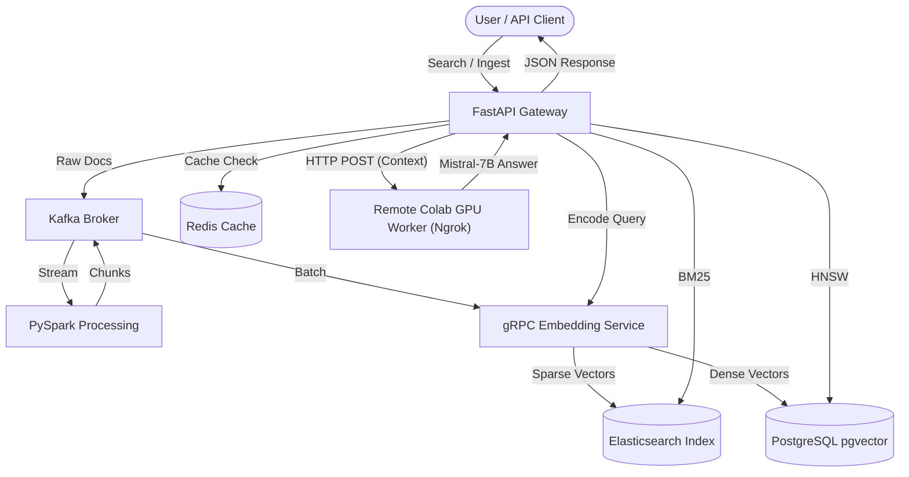

# Semantic Search & RAG Platform

<div align="center">

[](https://www.python.org)
[](https://fastapi.tiangolo.com)
[](https://spark.apache.org/)
[](https://kafka.apache.org/)
[](https://www.elastic.co/)
[](https://postgresql.org/)
[](https://huggingface.co/)
[](https://www.docker.com/)
[](https://www.terraform.io/)
[](https://colab.research.google.com/)
[](https://opensource.org/licenses/MIT)

A distributed microservices platform for **Enterprise Semantic Search** and **Retrieval-Augmented Generation (RAG)**. Capable of ingesting millions of documents, indexing them via Hybrid Search (BM25 + Dense Vectors + custom SPLADE v2), and serving sub-100ms LLM-powered answer generation.

</div>

---

## 🏛️ Architecture Flow



---

## ⚙️ Technical Specifications

This platform is meticulously designed referencing enterprise standards set by Elastic, Pinecone, and leading data architectures:

| Component | Technology | Description |
|-----------|------------|-------------|
| **API Gateway** | FastAPI, Redis, SlowAPI | High-throughput gateway handling rate limiting and request caching. |
| **Streaming Ingestion**| Apache Kafka, PySpark | Real-time scalable document ingestion, cleaning, and semantic chunking. |
| **Embeddings** | gRPC, Sentence-Transformers | Dual-encoder service processing Dense representations and custom SPLADE v2 sparse outputs. Dynamic batching enabled. |
| **Vector Indexing** | PostgreSQL + pgvector | HNSW indexed dense vector storage for precise Approximate Nearest Neighbors (ANN) lookups. |
| **Sparse Indexing** | Elasticsearch | Custom standard analyzers coupled with `rank_features` field types for BM25 and SPLADE retrieval. |
| **Hybrid Search** | Reciprocal Rank Fusion (RRF)| Algorithmic aggregation of Dense, Sparse, and Lexical scores into a single weighted pipeline. |
| **Re-Ranking** | HuggingFace Cross-Encoder | Late-interaction re-ranking (O(n) complexity) improving the final precision bounds. |
| **LLM Engine** | Mistral 7B (Quantized) | 4-bit `bitsandbytes` inference for robust answer generation with verifiable document citations. |
| **Observability** | MLflow, Prometheus | Granular metrics scraping and structured experiment tracking (A/B retrieval testing). |
| **Infrastructure** | Terraform, Kubernetes (EKS)| Cloud-native deployment provisioning via IaC with Argo Rollout canary integrations. |

---

This repository is optimized for isolated cloud-development environments like **GitHub Codespaces** and offloads heavy GPU Generation to **Google Colab**.

👉 **[Read the Step-by-Step GitHub Codespaces Setup Guide here](./github_codespaces_guide.md)**  
👉 **[Read the Heavy GPU Google Colab Guide here](./google_colab_guide.md)**

### Brief Overview of Running the Project

1. **Launch a GitHub Codespace**: Provision a 4-core, 8GB machine directly from the repository.
2. **Boot the Infrastructure**: 
   ```bash
   docker-compose up -d
   ```
   *(Codespaces natively supports Docker in Docker)*
3. **Check Service Health**:
   Wait ~60 seconds for Kafka and Elasticsearch to stabilize.
   ```bash
   curl http://localhost:8000/v1/health
   ```
4. **Ingest a Document**:
   ```bash
   curl -X POST http://localhost:8000/v1/ingest -F "source=manual" -F "content_type=markdown" -F "file=@README.md"
   ```
5. **Search the Knowledge Base**:
   ```bash
   curl -X POST http://localhost:8000/v1/search -H "Content-Type: application/json" -d '{"query": "What is the hybrid search strategy?", "generate_answer": true}'
   ```

---

## 🧪 Testing

A comprehensive test suite is included ensuring chunking stability and mathematical precision of the RRF algorithms.
```bash
# From the project root
pip install pytest
pytest tests/unit/
```

## 📜 License

Distributed under the MIT License. See `LICENSE` for more information.
